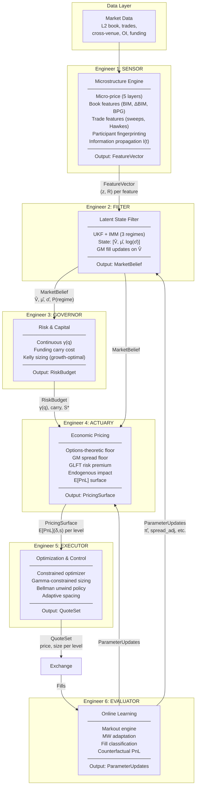
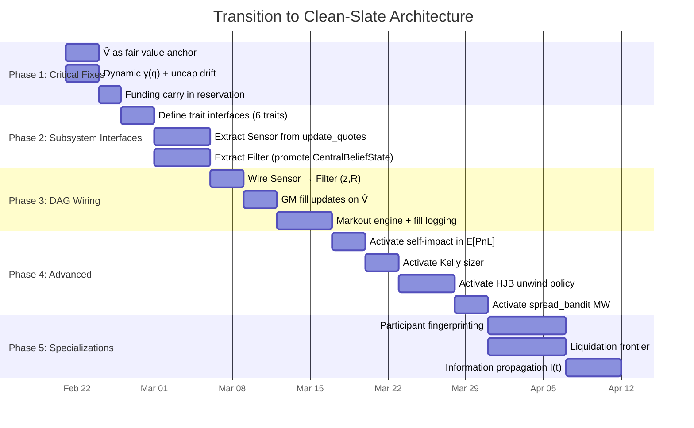

# Clean-Slate Architecture: Principled Design

> *Designed as if the unified adverse selection framework, spread extraction, and proprietary modeling were foundational assumptions from day one.*

---

## 1. Diagnosis: Why the Current System Underperforms

### The Monolith Problem

The entire quoting pipeline flows through [update_quotes()](file:///C:/Users/17808/Desktop/hyper_make/src/market_maker/orchestrator/quote_engine.rs) — a **4,063-line function** in [quote_engine.rs](file:///C:/Users/17808/Desktop/hyper_make/src/market_maker/orchestrator/quote_engine.rs). This single method:

1. Reads market data 
2. Updates estimators
3. Runs the belief system
4. Computes GLFT spreads
5. Builds the ladder
6. Filters for viability
7. Applies risk overlays
8. Emits orders

Every concern mixed into one control flow. When the drift estimator detects a trend, the signal must travel through the entire 3,500-line pipeline before reaching the order. Each subsystem's output is consumed by ad-hoc `if/else` branches rather than clean interfaces.

### The "Built But Disconnected" Problem

Examination reveals that **many RFC-aligned modules already exist** but aren't wired into the live pipeline:

| Module | Size | Status |
|---|---|---|
| [kelly.rs](file:///C:/Users/17808/Desktop/hyper_make/src/market_maker/strategy/kelly.rs) | 19 KB | `KellySizer` exists in [GLFTStrategy](file:///C:/Users/17808/Desktop/hyper_make/src/market_maker/strategy/glft.rs#208-224) — builds but unclear if active |
| [microprice.rs](file:///C:/Users/17808/Desktop/hyper_make/src/market_maker/estimator/microprice.rs) | 42 KB | `MicropriceEstimator` runs, logs `l1_micro`, but reservation price still uses exchange mid |
| [self_impact.rs](file:///C:/Users/17808/Desktop/hyper_make/src/market_maker/estimator/self_impact.rs) | 8 KB | Impact estimator exists, [with_self_impact()](file:///C:/Users/17808/Desktop/hyper_make/src/market_maker/mod.rs#659-664) builder — but no impact cost in E[PnL] |
| [liquidation.rs](file:///C:/Users/17808/Desktop/hyper_make/src/market_maker/process_models/liquidation.rs) | 32 KB | Liquidation model exists — not feeding pricing |
| [funding.rs](file:///C:/Users/17808/Desktop/hyper_make/src/market_maker/process_models/funding.rs) | 26 KB | Funding model exists — not in reservation price |
| [hawkes.rs](file:///C:/Users/17808/Desktop/hyper_make/src/market_maker/process_models/hawkes.rs) | 70 KB | Hawkes process model — runs but doesn't feed drift estimator as (z, R) |
| [hjb/](file:///C:/Users/17808/Desktop/hyper_make/src/market_maker/process_models/hjb) | 6 files | Full HJB optimal control solver with OU drift, queue value, skew — unclear if active |
| [competitor_model.rs](file:///C:/Users/17808/Desktop/hyper_make/src/market_maker/learning/competitor_model.rs) | 29 KB | Participant modeling exists — not feeding the filter |
| [spread_bandit.rs](file:///C:/Users/17808/Desktop/hyper_make/src/market_maker/learning/spread_bandit.rs) | 26 KB | Bandit-style spread optimizer — comment says "SpreadBandit is the optimizer now" |
| [edge_surface.rs](file:///C:/Users/17808/Desktop/hyper_make/src/market_maker/latent/edge_surface.rs) | 21 KB | E[PnL] surface computation — exists but may not be the active path |
| [central.rs](file:///C:/Users/17808/Desktop/hyper_make/src/market_maker/belief/central.rs) | 55 KB | [CentralBeliefState](file:///C:/Users/17808/Desktop/hyper_make/src/market_maker/belief/central.rs#373-378) with Bayesian updates, fill processing, cross-venue — partially active |
| [hjb_solver.rs](file:///C:/Users/17808/Desktop/hyper_make/src/market_maker/stochastic/hjb_solver.rs) | 20 KB | Stochastic HJB solver — exists alongside the GLFT |

> [!IMPORTANT]
> The system doesn't need to be built from scratch. **The components exist.** The problem is *orchestration* — the monolithic [update_quotes()](file:///C:/Users/17808/Desktop/hyper_make/src/market_maker/orchestrator/quote_engine.rs#31-3542) doesn't compose them into a coherent DAG. It picks from them via conditional branches and config flags, creating an exponential space of code paths that no one fully understands.

---

## 2. The Architecture: 6 Engineers, 1 DAG

If we had started with the unified principles from day one, we would have exactly 6 subsystems connected by typed interfaces. Each subsystem has one owner, one input type, one output type, and zero knowledge of the others' internals.



---

## 3. Subsystem Specifications

### Engineer 1: Microstructure Engine (The "Sensor")

**Owns**: Feature computation, signal extraction, participant modeling

**Principle**: Raw market data → structured observations with calibrated noise. Every feature is a [(z, R)](file:///C:/Users/17808/Desktop/hyper_make/src/market_maker/belief/central.rs#407-425) pair — a value and its uncertainty — feeding a single estimation interface.

#### Current code mapping

| Keep / Refactor | File | Action |
|---|---|---|
| ✅ Keep | [microprice.rs](file:///C:/Users/17808/Desktop/hyper_make/src/market_maker/estimator/microprice.rs) | **Promote** as primary fair value source. Currently computes but doesn't anchor pricing |
| ✅ Keep | [hawkes.rs](file:///C:/Users/17808/Desktop/hyper_make/src/market_maker/process_models/hawkes.rs) | Already models self-exciting arrival intensity. **Wire output as (z, R) to filter** |
| ✅ Keep | [trade_flow_tracker.rs](file:///C:/Users/17808/Desktop/hyper_make/src/market_maker/estimator/trade_flow_tracker.rs) | OFI computation. **Add observation interface** |
| ✅ Keep | [informed_flow.rs](file:///C:/Users/17808/Desktop/hyper_make/src/market_maker/estimator/informed_flow.rs) | Informed fraction estimation. **Feed into GM model** |
| ✅ Keep | [vpin.rs](file:///C:/Users/17808/Desktop/hyper_make/src/market_maker/estimator/vpin.rs) | Volume-synchronized PIN. **Feed as observation** |
| ✅ Keep | [competitor_model.rs](file:///C:/Users/17808/Desktop/hyper_make/src/market_maker/learning/competitor_model.rs) | **Activate.** It exists but appears disconnected |
| ⚠️ Refactor | [cross_venue.rs](file:///C:/Users/17808/Desktop/hyper_make/src/market_maker/estimator/cross_venue.rs) | Refactor into information propagation function I(t) |
| ⚠️ Refactor | [binance_flow.rs](file:///C:/Users/17808/Desktop/hyper_make/src/market_maker/estimator/binance_flow.rs) | Combine with cross_venue into lead-lag signal |

#### Interface

```rust
/// Every feature emits this. The filter consumes only this.
pub struct Observation {
    pub z: f64,           // observed value
    pub R: f64,           // observation noise variance 
    pub source: ObsSource, // for diagnostics only
    pub timestamp_ms: u64,
}

pub trait FeatureEngine {
    /// Compute all features from current market state.
    /// Returns a vector of observations for the filter.
    fn compute(&mut self, market: &MarketSnapshot) -> Vec<Observation>;
}
```

---

### Engineer 2: Latent State Filter (The "Filter")

**Owns**: Bayesian posterior over market state, regime detection, fill-conditioned value updates

**Principle**: The filter maintains a probability distribution over [(V, μ, σ)](file:///C:/Users/17808/Desktop/hyper_make/src/market_maker/belief/central.rs#407-425) — not point estimates. Exchange mid is one observation among many, not the anchor.

#### Current code mapping

| Keep / Refactor | File | Action |
|---|---|---|
| ⚠️ Refactor | [central.rs](file:///C:/Users/17808/Desktop/hyper_make/src/market_maker/belief/central.rs) | **This is the heart.** Already has [CentralBeliefState](file:///C:/Users/17808/Desktop/hyper_make/src/market_maker/belief/central.rs#373-378) with Bayesian updates. Refactor to emit `MarketBelief` |
| ⚠️ Refactor | [snapshot.rs](file:///C:/Users/17808/Desktop/hyper_make/src/market_maker/belief/snapshot.rs) | `BeliefSnapshot` has the right structure. Promote to be the *only* belief interface |
| ⚠️ Refactor | [drift_estimator.rs](file:///C:/Users/17808/Desktop/hyper_make/src/market_maker/strategy/drift_estimator.rs) | **Subsume into the filter.** Currently a separate Kalman on drift — merge into joint filter |
| ⚠️ Refactor | [regime_hmm.rs](file:///C:/Users/17808/Desktop/hyper_make/src/market_maker/estimator/regime_hmm.rs) | **Keep as IMM wrapper.** Already has HMM regime detection. Wire as the IMM mode selector |
| ⚠️ Refactor | [kalman.rs](file:///C:/Users/17808/Desktop/hyper_make/src/market_maker/estimator/kalman.rs) | Scalar Kalman filter. **Upgrade to UKF** or keep as fast path for the Quiet regime only |
| ✅ Keep | [latent_filter.rs](file:///C:/Users/17808/Desktop/hyper_make/src/market_maker/estimator/latent_filter.rs) | Already started. **Expand to full UKF** |
| ❌ Remove | [volatility_filter.rs](file:///C:/Users/17808/Desktop/hyper_make/src/market_maker/estimator/volatility_filter.rs) | σ should be a state variable in the joint filter, not a separate estimator |

#### Interface

```rust
/// The filter's output — the single source of truth.
pub struct MarketBelief {
    pub fair_value: f64,      // V̂ — NOT exchange mid
    pub fair_value_var: f64,  // uncertainty on V̂
    pub drift: f64,           // μ̂ (bps/sec)
    pub drift_var: f64,       // uncertainty on μ̂
    pub sigma: f64,           // σ̂ (realized vol, annualized)
    pub regime_probs: [f64; 3], // P(Quiet), P(Trending), P(Crisis)
    pub informed_fraction: f64, // π̂ for GM model
    pub timestamp_ms: u64,
}

pub trait LatentFilter {
    /// Predict step (time passes, uncertainty grows).
    fn predict(&mut self, dt_secs: f64);
    
    /// Update step (new observations arrive).
    fn update(&mut self, observations: &[Observation]);
    
    /// Adversarial fill update (Glosten-Milgrom).
    fn update_fill(&mut self, side: Side, price: f64, size: f64);
    
    /// Get current belief.
    fn belief(&self) -> MarketBelief;
}
```

> [!IMPORTANT]
> **The GM fill update is the biggest single missing piece.** When someone fills our ask at $29.00, the filter should instantly shift V̂ upward — "fair value is at least $29.00, probably higher." The current system only updates position, not V̂.

---

### Engineer 3: Risk & Capital Allocation (The "Governor")

**Owns**: Inventory penalty, funding carry, portfolio sizing, risk budget

**Principle**: The marginal cost of one more unit of inventory is a smooth, convex, continuously computed number. No zones, no gates, no discrete thresholds.

#### Current code mapping

| Keep / Refactor | File | Action |
|---|---|---|
| ⚠️ Refactor | [risk_model.rs](file:///C:/Users/17808/Desktop/hyper_make/src/market_maker/strategy/risk_model.rs) | Has `CalibratedRiskModel`. **Make γ a function of q, not a constant** |
| ⚠️ Refactor | [kelly.rs](file:///C:/Users/17808/Desktop/hyper_make/src/market_maker/strategy/kelly.rs) | `KellySizer` exists! **Activate it.** Wire its output as the total exposure limit |
| ⚠️ Refactor | [funding.rs](file:///C:/Users/17808/Desktop/hyper_make/src/market_maker/process_models/funding.rs) | **Add carry cost to reservation price.** The math is in the RFC, the data feed exists |
| ⚠️ Refactor | [inventory_governor.rs](file:///C:/Users/17808/Desktop/hyper_make/src/market_maker/risk/inventory_governor.rs) | **Replace with continuous γ(q).** Currently likely has zone-based logic |
| ❌ Remove | [position_guard.rs](file:///C:/Users/17808/Desktop/hyper_make/src/market_maker/risk/position_guard.rs) | Discrete position zones → continuous γ(q) makes this redundant |
| ❌ Remove | [reentry.rs](file:///C:/Users/17808/Desktop/hyper_make/src/market_maker/risk/reentry.rs) | Re-entry logic after gate pullback — no gates → no re-entry needed |

#### Interface

```rust
pub struct RiskBudget {
    pub gamma_q: f64,            // γ(q) — continuous, convex
    pub funding_carry_bps: f64,  // instantaneous carry cost
    pub kelly_exposure: f64,     // S* — total allowed notional
    pub kelly_fraction: f64,     // f(regime) — fractional Kelly
    pub marginal_cost: f64,      // cost of adding 1 more unit
}

pub trait RiskGovernor {
    fn compute(&self, belief: &MarketBelief, position: f64) -> RiskBudget;
}
```

**The γ(q) function:**
```rust
fn gamma(q: f64, q_max: f64, gamma_base: f64, beta: f64) -> f64 {
    gamma_base * (1.0 + beta * (q / q_max).powi(2))
}
// At q=0: γ = γ_base (normal trading)
// At q=q_max: γ = γ_base × (1 + β) (very wide spreads, tiny sizes)
// The transition is smooth — no boundaries, no zones
```

---

### Engineer 4: Economic Pricing Engine (The "Actuary")

**Owns**: Spread computation, E[PnL] evaluation, options-theoretic floor, impact pricing

**Principle**: Every quote is a short option. Its existence is justified only by strictly positive E[PnL] after accounting for adverse selection, self-impact, carry, and vol exposure.

#### Current code mapping

| Keep / Refactor | File | Action |
|---|---|---|
| ✅ Keep | [glft.rs](file:///C:/Users/17808/Desktop/hyper_make/src/market_maker/strategy/glft.rs) | The GLFT math is correct. **Keep the formula, replace the inputs.** Feed V̂ instead of mid, γ(q) instead of static γ, κ_buy/κ_sell instead of single κ |
| ✅ Keep | [expected_pnl_bps()](file:///C:/Users/17808/Desktop/hyper_make/src/market_maker/strategy/glft.rs#L14-L65) | Already computes E[PnL] per level with drift, AS, carry. **Add impact cost term** |
| ⚠️ Refactor | [self_impact.rs](file:///C:/Users/17808/Desktop/hyper_make/src/market_maker/estimator/self_impact.rs) | Impact estimator exists. **Wire its output into E[PnL] as a cost subtraction** |
| ⚠️ Refactor | [edge_surface.rs](file:///C:/Users/17808/Desktop/hyper_make/src/market_maker/latent/edge_surface.rs) | E[PnL] surface computation. **Activate and make it the single pricing output** |
| ✅ Keep | [spread_oracle.rs](file:///C:/Users/17808/Desktop/hyper_make/src/market_maker/strategy/spread_oracle.rs) | Spread composition from multiple sources. **Add GM floor and option floor** |
| ⚠️ New | (new) `option_floor.rs` | [with_option_floor()](file:///C:/Users/17808/Desktop/hyper_make/src/market_maker/mod.rs#653-658) builder exists — the module needs expanding. Floor = `σ × √(τ / 2π)` |

#### Interface

```rust
pub struct PricingSurface {
    pub reservation: f64,           // r(t, q) — the indifference price
    pub levels: Vec<LevelPricing>,  // per-level economics
}

pub struct LevelPricing {
    pub depth_bps: f64,
    pub bid_price: f64,
    pub ask_price: f64,
    pub bid_epnl: f64,         // E[PnL] for this bid level
    pub ask_epnl: f64,         // E[PnL] for this ask level
    pub bid_size_optimal: f64, // s* from convex optimization
    pub ask_size_optimal: f64,
    pub theta: f64,            // spread income rate
    pub gamma: f64,            // adverse selection exposure
    pub impact_cost: f64,      // self-impact cost
}

pub trait PricingEngine {
    fn compute(
        &self,
        belief: &MarketBelief,
        risk: &RiskBudget,
        book: &L2Book,
    ) -> PricingSurface;
}
```

**Key change — the reservation price anchors on V̂:**
```rust
// OLD (current):
let reservation = mid + drift_shift - inventory_penalty;

// NEW:
let reservation = belief.fair_value          // V̂ from filter, NOT exchange mid
    + drift_shift(belief.drift, tau_eff, risk.gamma_q, belief.sigma)
    - inventory_penalty(position, risk.gamma_q, belief.sigma, tau_remaining)
    - risk.funding_carry_bps * position;     // carry cost (was missing)
```

---

### Engineer 5: Optimization & Control (The "Executor")

**Owns**: Quote allocation, order lifecycle, reconciliation, staleness management

**Principle**: Given a pricing surface with E[PnL] per level, solve for the allocation that maximizes total Θ (spread income) subject to Γ ≤ budget and Kelly exposure ≤ S*. 

#### Current code mapping

| Keep / Refactor | File | Action |
|---|---|---|
| ✅ Keep | [entropy_distribution.rs](file:///C:/Users/17808/Desktop/hyper_make/src/market_maker/quoting/ladder/entropy_distribution.rs) | Keep for now. **Eventually replace with convex optimizer** once impact model is stable |
| ✅ Keep | [tick_grid.rs](file:///C:/Users/17808/Desktop/hyper_make/src/market_maker/quoting/ladder/tick_grid.rs) | Tick discretization is correct for Hyperliquid's exchange grid |
| ✅ Keep | [reconcile.rs](file:///C:/Users/17808/Desktop/hyper_make/src/market_maker/orchestrator/reconcile.rs) | Keep the reconciler. **Fix latching threshold to respect urgency** |
| ⚠️ Refactor | [generator.rs](file:///C:/Users/17808/Desktop/hyper_make/src/market_maker/quoting/ladder/generator.rs) | 90KB ladder generator. **Simplify** — let the pricing surface decide, not the generator |
| ⚠️ Refactor | [ladder_strat.rs](file:///C:/Users/17808/Desktop/hyper_make/src/market_maker/strategy/ladder_strat.rs) | 170KB! This file does too much. **Split**: pure math (keep) vs orchestration (move to Engineer 5 coordinator) |
| ⚠️ Refactor | [hjb/](file:///C:/Users/17808/Desktop/hyper_make/src/market_maker/process_models/hjb) | HJB solver exists with [skew.rs](file:///C:/Users/17808/Desktop/hyper_make/src/market_maker/process_models/hjb/skew.rs) (35KB). **Activate as the Bellman unwind policy** |

#### Interface

```rust
pub struct QuoteSet {
    pub bids: Vec<Quote>,  // price + size per level
    pub asks: Vec<Quote>,
    pub metadata: QuoteMetadata,
}

pub trait QuoteOptimizer {
    fn optimize(
        &self,
        surface: &PricingSurface,
        risk: &RiskBudget,
        book: &L2Book,
    ) -> QuoteSet;
}
```

---

### Engineer 6: Online Learning & Feedback (The "Evaluator")

**Owns**: Fill quality measurement, adaptation, counterfactual analysis

**Principle**: Every fill is classified. The system adapts continuously. No parameter is permanent.

#### Current code mapping

| Keep / Refactor | File | Action |
|---|---|---|
| ✅ Keep | [spread_bandit.rs](file:///C:/Users/17808/Desktop/hyper_make/src/market_maker/learning/spread_bandit.rs) | Bandit-style adaptation. **This IS the MW learner.** Already built. **Verify it's active** |
| ✅ Keep | [calibrated_edge.rs](file:///C:/Users/17808/Desktop/hyper_make/src/market_maker/control/calibrated_edge.rs) | Edge calibration. Keep and feed markout data |
| ✅ Keep | [pre_fill_classifier.rs](file:///C:/Users/17808/Desktop/hyper_make/src/market_maker/adverse_selection/pre_fill_classifier.rs) | 67KB classifier. **This is the fill toxicity model.** Wire its output to post-fill response |
| ⚠️ Refactor | [processor.rs](file:///C:/Users/17808/Desktop/hyper_make/src/market_maker/fills/processor.rs) | 80KB fill processor. **Add markout computation** (log mid at t+1s, 5s, 10s, 30s, 60s, 300s) |
| ⚠️ New | (new) `markout_engine.rs` | Decompose each fill into realized_spread + temporary_impact + permanent_impact |
| ✅ Keep | [changepoint.rs](file:///C:/Users/17808/Desktop/hyper_make/src/market_maker/control/changepoint.rs) | Changepoint detection. Keep as a regime-shift trigger |

---

## 4. The Restructured Quote Cycle

The current 4,063-line [update_quotes()](file:///C:/Users/17808/Desktop/hyper_make/src/market_maker/orchestrator/quote_engine.rs#31-3542) becomes a **20-line coordinator**:

```rust
fn quote_cycle(&mut self) -> Result<()> {
    // Step 1: SENSOR — compute features
    let observations = self.sensor.compute(&self.market_snapshot);
    
    // Step 2: FILTER — update belief
    self.filter.predict(self.dt_since_last_cycle);
    self.filter.update(&observations);
    for fill in self.new_fills.drain(..) {
        self.filter.update_fill(fill.side, fill.price, fill.size);
    }
    let belief = self.filter.belief();
    
    // Step 3: GOVERNOR — compute risk budget
    let risk = self.governor.compute(&belief, self.position);
    
    // Step 4: ACTUARY — compute pricing surface
    let surface = self.actuary.compute(&belief, &risk, &self.book);
    
    // Step 5: EXECUTOR — optimize and emit quotes
    let quotes = self.executor.optimize(&surface, &risk, &self.book);
    self.reconciler.apply(quotes)?;
    
    // Step 6: EVALUATOR — feedback (async, doesn't block cycle)
    self.evaluator.record_cycle(&belief, &surface, &quotes);
    
    Ok(())
}
```

> [!CAUTION]
> This is not "delete everything and start over." This is *reorganizing existing code into the DAG*. The GLFT math stays. The Kalman filter stays. The reconciler stays. What changes is *who calls what* and *through what interface*.

---

## 5. What Gets Deleted

These modules exist to compensate for architectural gaps. With the correct architecture, they become redundant:

| Module | Why It Exists | Why It's Redundant |
|---|---|---|
| Quote gate logic | Binary pull at 50% position | Continuous γ(q) + E[PnL] ≤ 0 replaces it |
| [position_guard.rs](file:///C:/Users/17808/Desktop/hyper_make/src/market_maker/risk/position_guard.rs) | Discrete zone boundaries | Continuous γ(q) |
| [reentry.rs](file:///C:/Users/17808/Desktop/hyper_make/src/market_maker/risk/reentry.rs) | Logic to re-enter after gate pullback | No gates → no re-entry |
| `signal_weight` | Dead wire between trend and gate | Kalman gain replaces it |
| `smoothed_drift` EWMA | Warmup mechanism | Kalman cold start handles naturally |
| Staleness defense (additive bps flip) | Asymmetric spread heuristic | Per-side freshness function + V̂ anchoring |
| `toxicity_size_mult` | Separate multiplicative overlay | Directional κ handles natively |
| `drift_adj_bps` cap (±3) | Prevents large drift shifts | No cap needed — drift_shift is principled |

---

## 6. The 5 Critical Interventions (Ordered by Impact)

### Intervention 1: Activate V̂ as Fair Value Anchor

**What changes**: Replace `mid` with `belief.fair_value` in the reservation price equation.

**Why first**: This single change fixes BBO crossing (the #1 operational failure). The `MicropriceEstimator` already computes a superior V̂ — it just isn't used. Stale exchange mid causes the 78-tick gaps between computed quotes and live book.

**Touches**: [quote_engine.rs](file:///C:/Users/17808/Desktop/hyper_make/src/market_maker/orchestrator/quote_engine.rs), [ladder_strat.rs](file:///C:/Users/17808/Desktop/hyper_make/src/market_maker/strategy/ladder_strat.rs)

---

### Intervention 2: Dynamic γ(q) + Uncap Drift

**What changes**: `gamma: 2.000` → `gamma_q = gamma_base * (1.0 + beta * (q/q_max).powi(2))`. Remove EWMA zeroing of drift signal.

**Why second**: Prevents the inventory trap (95% capacity) and enables the drift estimator to actually skew quotes when trending.

**Touches**: [glft.rs](file:///C:/Users/17808/Desktop/hyper_make/src/market_maker/strategy/glft.rs), [risk_model.rs](file:///C:/Users/17808/Desktop/hyper_make/src/market_maker/strategy/risk_model.rs), [drift_estimator.rs](file:///C:/Users/17808/Desktop/hyper_make/src/market_maker/strategy/drift_estimator.rs)

---

### Intervention 3: Funding Carry in Reservation Price

**What changes**: Add `- position * funding_rate * tau_funding` to the reservation price. Wire [funding.rs](file:///C:/Users/17808/Desktop/hyper_make/src/market_maker/process_models/funding.rs) output into the pricing equation.

**Why third**: Holding longs with positive funding is paying to lose. The data feed already exists.

---

### Intervention 4: GM Fill Updates + Markout Engine

**What changes**: After every fill, shift V̂ based on adversarial evidence (the GM update). Add markout logging: record mid at t+{1, 5, 10, 30, 60, 300}s after each fill. Compute shape classification.

**Why fourth**: Enables all downstream calibration — π̂, counterfactual PnL, fill-conditional response. The [pre_fill_classifier.rs](file:///C:/Users/17808/Desktop/hyper_make/src/market_maker/adverse_selection/pre_fill_classifier.rs) already classifies fill toxicity. Wire its output to the GM update gain.

---

### Intervention 5: Activate Self-Impact in E[PnL]

**What changes**: In [expected_pnl_bps()](file:///C:/Users/17808/Desktop/hyper_make/src/market_maker/strategy/glft.rs#14-66), subtract [self_impact(size, book_depth)](file:///C:/Users/17808/Desktop/hyper_make/src/market_maker/mod.rs#659-664). The [self_impact.rs](file:///C:/Users/17808/Desktop/hyper_make/src/market_maker/estimator/self_impact.rs) estimator already exists. Wire its `α` and `β` into the E[PnL] calculation.

**Why fifth**: On thin HIP-3 books where we are 30-60% of depth, ignoring self-impact overestimates edge by ~10-15 bps per fill.

---

## 7. Transition Path



---

## 8. Summary

The system doesn't need a rewrite. It needs **surgery on the orchestration layer**.

The components exist: Kelly sizer, microprice estimator, self-impact model, Hawkes process, HJB solver, spread bandit, belief state, funding model, liquidation model, competitor model. What's missing is the **DAG** that connects them in the right order through **typed interfaces**.

The 4,063-line [update_quotes()](file:///C:/Users/17808/Desktop/hyper_make/src/market_maker/orchestrator/quote_engine.rs#31-3542) function is the tumor. It contains the right computations in the wrong structure. Decomposing it into the 6-subsystem DAG with the 20-line coordinator is the single highest-leverage change in the entire system.

The 5 critical interventions (V̂ anchor, dynamic γ, funding carry, GM updates, self-impact) could each be implemented in 1-3 days by someone familiar with the codebase. Together, they address the root causes of the –$3.83 session we analyzed and transform the system from a defensive hedgehog into a principled pricing engine.
